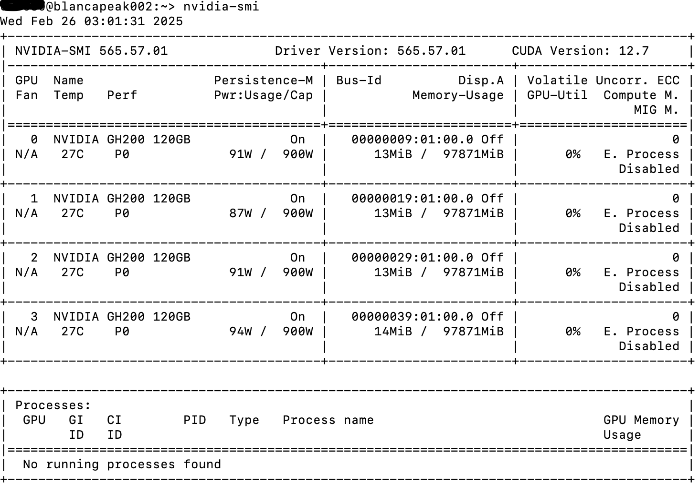
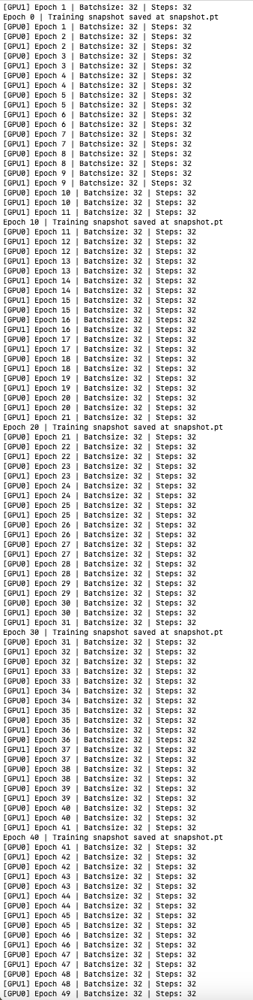

# How to utilize the distributed Pytorch to efficiently run your training job on Early Access Platform(EAP)/Olivia
In this tutorial we will guide you through the steps that you might want to follow when running your training jobs on multiple GPUs in EAP.Whenever, we want to accelerate our training jobs where we can parallelize compute-intensive tasks ,we probably want to utilize the GPUs to make it faster.

If you want to learn more about GPU programming. please refer to this material [GPU Programming.When,Why and How?](https://enccs.github.io/gpu-programming/) . Also, you can watch this youtube video [GPU course](https://www.youtube.com/watch?v=Yv87u2zQPJU&list=PL2GgjY1xUzfCwdcqcvXD17qyWhW4wM_Sy) , which is the video material for this course.

We will also quickly discuss here about how we can effectively utilize multiple GPUs in multiple nodes. If we think of utilizing multiple GPUs we should always make sure that our code supports multiple GPUs. Having a infrastructure itself is not enough.

If we are using high-level frameworks like Hugging face or Pytorch Lightening, it can simplyfy the process of implementing multi-GPU training, as they handle many of the complexities involved in distributing workloads and synchronizing updates.

For instance, if we are importing Trainer and other necessary components from the transformers library as shown below, which is designed to handle distributed training automatically when the appropriate environment variables are set we dont need to do anything.

`````
from transformers import (AutoModelForCausalLM, AutoTokenizer,
                          DataCollatorForLanguageModeling, Trainer,
                          TrainingArguments)

`````
However, to use multiple GPUs with PyTorch, there are three main ways.These are:
1. Data Parallelism

In this method, datasets are broken into subsets which are processed in batches on different GPUs using the same model. The results are then combined and averaged in one version of the model. This method relies on the DataParallel class. When using this class, you define your GPU IDs and initialize your network using a Module object with a DataParallel object.

````
parallel_net = nn.DataParallel(myNet, gpu_ids = [0,1,2])
````

Once defined, you can perform the standard model training steps just as you would with a standard nn.Module object. For example:

1. performs a forward pass
````
predictions = parallel_net(inputs) 
````
2. computes a loss function
````
loss = loss_function(predictions, labels)
````
3. averages GPU-losses and performs a backward pass
````
loss.mean().backward()
optimizer.step()
````
When using this method, you need to ensure that your data is initially stored on one GPU (the “primary GPU”). You should also place your data parallel object on that same GPU. You can do this using code like the following:

````
input = input.to(0)
parallel_net = parellel_net.to(0)
````

Then, when you call your object it can split your dataset into batches that are distributed across your defined GPUs. Once the operations are complete, the outputs are aggregated on the primary GPU.


2. Distributed data parallelism

This technique enables you to perform data parallelism across GPUs and physical machines and can be combined with model parallelism. This method relies on the DistributedDataParallel class.
With this class, you should create one process for each model replica you need. These replicas can then span multiple devices. This class also enables you to split your model (model parallelism) if you combine it with the model_parallel class. We will discuss briefly about the Distributed Data Parallel in the section below.

The main difference between DataParallel and DistributedDataParallel is that the former only works for single-processes while the later can work for single or multi-process training. This means you can run your model across multiple machines with DistributedDataParallel. Additionally, DataParallel may be slower than DistributedDataParallel due to thread interpretation issues and increased overhead created by distribution.


3. Model Parallelism

In this technique, a single model is broken into segments with each segment run on different GPUs. The results from the segments are then combined to produce a completed model. This method relies on the model_parallel class. We will discuss this part in the separate tutorial.
It is nice to know at this point that, there is hybrid approaches like Fully-sharded Data Parallel(FSDP) that shards model parameters across GPU, reducing the memory usage and enabling consistent training. Moreover, there is also a deep learning optimization library called DeepSpeed that provides tools for efficient training on large models and datasets, including features like model parallelism and memory optimization. All these are similar to traditional model parallelism but often includes optimizations to improve efficiency and reduce communication overhead.


Selection of these approaches depends upon the specific criteria. For most scenarios, DistributedDataParallel(DDP) is a robust and straightforward option. However, for very large models, hybrid approaches like FSDP or DeepSpeed may be necessary.


Now, before we dive into details of DDP, lets start to get our hands on EAP and set the environment so that we can utilize the GPUs on it.

Once you are logged into EAP, you will be in one of the login node. At this point, the login nodes have x86_64 architecture.you can verify that using this command `lscpu `.

To get the information about the modules available on the EAP, we need to login to the compute node. We will allocate the resources interactively using the command below to get the resources we need. We will be using the PBS/Torque scheduler for it.

````
qsub -I -l select=1:ncpus=4:mpiprocs=4:ngpus=1:sales_op=blanca,walltime=00:30:00 -q blanca

````

qsu can be used for both batch jobs (submitting a script to run in the background) and interactive jobs (getting a shell on a compute node).We can typically submit a script using qsub that contains commands to be executed on the compute nodes.The above command requests one compute node with 4 CPUs, 4 MPI processes, 1 GPU, and a specific resource (sales_op=blanca) for an interactive session.  The session will be terminated after 30 minutes.  The job will be submitted to the "blanca" queue.

Once , you are inside the compute node, if you use this command `uname -a` , it will show that our compute node has an aarch64 (also sometimes called ARM64 or ARMv8) architecture. Since, we have a different architecture on the login nodes and the compute node, we need to be careful of softwares that we might want to run on the compute node. i.e. they should be specific to aarch64 and not x86_64.

Now that we allocate the resources and understand the architecture, lets check if we can see the GPUs on the compute node. We can use this command `nvidia-smi` to view the GPU available on the compute node.Below is the screenshot of it. You can also use this command to get more information about the cuda `nvcc --version`. 



## Setting up the necessary environment 
For our DDP use case, we will need to set up the environment as described below:

1. Check the necessary modules and load them.Inside the compute node you can check the available modules using `module avail` command. We will be loading these two modules.
````
module load cray-python/3.11.7
module load cuda/12.6
````
2. Create the directory where you will be putting all these codes. Inside the directory, create the requirements.txt file using this command `touch requirements.txt`

Open the requirements.txt file using this command `vim requirements.txt`.Since,our DDP uses this packages put them on the requirements file.

````
filelock==3.16.1
fsspec==2024.12.0
Jinja2==3.1.5
MarkupSafe==3.0.2
mpmath==1.3.0
networkx==3.2.1
numpy==2.2.2
pillow==11.1.0
setuptools==53.0.0
sympy==1.13.1
typing_extensions==4.12.2
`````

3. We will create a virtual environment `python -m venv myenv`, and then activate the environment using `source myenv\bin\activate`. Inside the virtual environment we created, install these packages using the commmand `pip install -r requirements.txt` togethar with pyTorch  so that we have our environment set up to run the DDP code. For the pyTorch we need to make sure that we install the pytorch specific to the cuda version we have inside the virtual environment.
````

pip3 install torch torchvision torchaudio --index-url https://download.pytorch.org/whl/cu126
````

At this point, if you enter the command `pip list`, you should be able to see all the packages installed earlier.

Then you can deactivate the virtual environment using this command `deactivate`


Note: We are developing this tutorial based on the officila PyTorch documentation.

## Training the model on single GPU in EAP without DDP

We will first do the training on the single GPU and migrate it to multiple GPU using DDP.In the single GPU code, we have the Trainer class that takes the model, the training data and the optimizer along with the device we are running on and how often we should be checking our model checkpoints.The training happens in the _run_epoch method and we call train specifying how many epochs we want to run our training job on. 
We have a few helper functions load_train_objs() which loads all of the objects we will need to for training process,namely the training dataset and model itself and an optimizer.For this specific example for the model , we are using the linear layer and the training dataset is just some random numbers.The optimizers is registered to all of the parameters of the model.Also there is a function, prepare_dataloader() which takes the dataset and wraps DataLoader around it.We can specify the batch size over there.

At first we want to run the script for 10 epochs and save it at every 2nd epoch.We are using the device = 0 which essentially lets Pytorch know to use the first available GPU.Below you will find the python codes and the job script for that.

single_gpu.py
```python
import torch
import torch.nn.functional as F
from torch.utils.data import Dataset, DataLoader
from datautils import MyTrainDataset


class Trainer:
    def __init__(
        self,
        model: torch.nn.Module,
        train_data: DataLoader,
        optimizer: torch.optim.Optimizer,
        gpu_id: int,
        save_every: int, 
    ) -> None:
        self.gpu_id = gpu_id
        self.model = model.to(gpu_id)
        self.train_data = train_data
        self.optimizer = optimizer
        self.save_every = save_every

    def _run_batch(self, source, targets):
        self.optimizer.zero_grad()
        output = self.model(source)
        loss = F.cross_entropy(output, targets)
        loss.backward()
        self.optimizer.step()

    def _run_epoch(self, epoch):
        b_sz = len(next(iter(self.train_data))[0])
        print(f"[GPU{self.gpu_id}] Epoch {epoch} | Batchsize: {b_sz} | Steps: {len(self.train_data)}")
        for source, targets in self.train_data:
            source = source.to(self.gpu_id)
            targets = targets.to(self.gpu_id)
            self._run_batch(source, targets)

    def _save_checkpoint(self, epoch):
        ckp = self.model.state_dict()
        PATH = "checkpoint.pt"
        torch.save(ckp, PATH)
        print(f"Epoch {epoch} | Training checkpoint saved at {PATH}")

    def train(self, max_epochs: int):
        for epoch in range(max_epochs):
            self._run_epoch(epoch)
            if epoch % self.save_every == 0:
                self._save_checkpoint(epoch)


def load_train_objs():
    train_set = MyTrainDataset(2048)  # load your dataset
    model = torch.nn.Linear(20, 1)  # load your model
    optimizer = torch.optim.SGD(model.parameters(), lr=1e-3)
    return train_set, model, optimizer


def prepare_dataloader(dataset: Dataset, batch_size: int):
    return DataLoader(
        dataset,
        batch_size=batch_size,
        pin_memory=True,
        shuffle=True
    )


def main(device, total_epochs, save_every, batch_size):
    dataset, model, optimizer = load_train_objs()
    train_data = prepare_dataloader(dataset, batch_size)
    trainer = Trainer(model, train_data, optimizer, device, save_every)
    trainer.train(total_epochs)


if __name__ == "__main__":
    import argparse
    parser = argparse.ArgumentParser(description='simple distributed training job')
    parser.add_argument('total_epochs', type=int, help='Total epochs to train the model')
    parser.add_argument('save_every', type=int, help='How often to save a snapshot')
    parser.add_argument('--batch_size', default=32, type=int, help='Input batch size on each device (default: 32)')
    args = parser.parse_args()
    
    device = 0  # shorthand for cuda:0
    main(device, args.total_epochs, args.save_every, args.batch_size)
```


datautils.py
```python
import torch
from torch.utils.data import Dataset

class MyTrainDataset(Dataset):
    def __init__(self, size):
        self.size = size
        self.data = [(torch.rand(20), torch.rand(1)) for _ in range(size)]

    def __len__(self):
        return self.size
    
    def __getitem__(self, index):
        return self.data[index]
```

job.sh
```bash
#!/bin/bash

module load cray-python/3.11.7
module load cuda/12.6
#verify module load
module list

source /home/users/<your-username>/ddpTest/myenv/bin/activate
python /home/users/<your-username>/ddpTest/single_gpu.py 10 2
deactivate
```

output:


## Distributed Data Parallel (DDP) in EAP using mutiple GPUs on single node

To understand how Distributed Data Parallel works in detail, please refer to this documentation. It will explain each part of the python code that is given below:
[DDP details](ddpDetails.md)

### Training the model on multiple GPUs in EAP
Now, moving forward, we can migrate this to multi GPU via DDP.For that we are going to need a few modules.
(import torch.multiprocessing as mp) is a wrapper, around python's native multiprocessing. Another one is (from torch.utils.data.distributed import DistributedSampler) which is the module that takes in our input data and distribute it across all of our GPUs. Similarly, we have (from torch.nn.parellel import DistributedDataParallel as DDP) which is the main workhorse.And finally we have these two functions (from torch.distributed import init_process_group, destroy_process_group) which initialized and destroy our distributed process group. We also need (import os) modules.

The first thing we want to do here is to initialize the distributed process group which consists of all of the processes that are running on our GPUs.Typically each GPU runs one process and setting up a group is necessary so that all the process can discover and communicate with each other.So we are going to write a new function that will take two arguments the ranks and the world_size. The world_size is the total number of processes in a group.And the rank is the unique identifier that is assigned to each process.It usually ranges from 0 to world_size-1.Inside this function we will set up some environment variables.The first one being the MASTER_ADDRESS which refers to the IP address of the machine that is running the rank 0 Process.We should also include any free port on the machine.And the reason we set up the master is that this machines coordinates the communication across all of our processes.Finally we call the init_process_group which initializes the default distributed process group which takes in an argument backend which will be (nccl- NVIDIA Collective Communications Library) that is used for distributed communications across CUDA GPUs, along with this argument we also need to pass on the rank and the world_size.

 The Trainer class mostly remains the same, except that before we start training our model, we need to wrap it with DDP and along with the model itself, it takes a device_ids argument which is a single list consisting of the GPU ID that the model  lives on. 

 Moreover, when we are saving our model state_dict,we need to do it differently.Since, we have now wrapped it with DDP self.model now refers to the DDP-Wrapped Object.And if we want to access the underlying  model's paraemters, we can call it using (model.module).

 So now the way DDP works is that it is going to lunch a process on each GPU.Each process is going to initialize and object of the Trainer class and in our previous code implementation, it is written in a way that it going to save a check point from each process which will create an unnecessary redundancy.We can do it for only one copy for the testing purpose since all of the copies are same.We can do it by adding the condition as shown below which ensures the checkppoint is saved from rank 0 process.

 ````bash
  if self.gpu_id == 0 and epoch % self.save_every == 0:
                self._save_checkpoint(epoch)
 ````

Next thing we want to change is the DataLoader.We  need to include the DistributedSampler which ensures that the input batch is going to be chuncked across all GPUs without any overlapping samples.And since we are passing sampler to DataLoader we need to turn shuffle to False as shown below:

````bash
return DataLoader(
        dataset,
        batch_size=batch_size,
        pin_memory=True,
        shuffle=False,
        sampler=DistributedSampler(dataset)
    )
````

Now,after this heavy lifting, we need to update our main function.First, we need to iniitialize our distributed process group as we have already written function for that.We also need to replace the device with rank and also include world_size as an argument.And finally,once the training job is run, we need to destroy the process group to cleanly exit our DDP training.But, before doing any of these, we will deep dive into the fault tolerant aspect where we will be using Torchrun. Note that,using Torchrun, we will make a lot of changes in the code as it will handle  many things for us which are discussed below:

### Fault-Tolerant aspect using Torchrun

we need to think about fault-tolerant training. And the way we can do it is by using Torchrun.

Using torchrun handles the setting of environment variables under the hood automatically.i.e we dont need to explicitly state the address and the port of our main machine.We just need to set the backend we are running on.This is shown below:

````bash
def ddp_setup():
    torch.cuda.set_device(int(os.environ["LOCAL_RANK"]))
    init_process_group(backend="nccl")
````

In the definition of the Trainer class, we were supposed to pass the rank of the process based on the GPU it was running on.But,now Torchrun provides an environment variable called local rank that we can access over there.The change is shown below:

````bash
self.gpu_id = int(os.environ["LOCAL_RANK"])
self.model = model.to(self.gpu_id)
````

To be fault tolerant, our training script needs to save more than just the models.In addition to the model state,we need to persist how many epochs have already been run.For that we need to add the argument for the snapshot_path.We already have a save_every which determines how often our model saves a checkpoint.Now we need to update it to save a snapshot instead.So the hyperparameter we want to set is epoch_run. We need to initialized it to 0 first which is the default case.And if a snapshot exist,we want our trainer class to be able to load that.In the _load_snapshot function we are going to read the model state, and then loading that into self.model. Once it is done, we have to wrap ddp around it. It is shown below:

````bash
class Trainer:
    def __init__(
        self,
        model: torch.nn.Module,
        train_data: DataLoader,
        optimizer: torch.optim.Optimizer,
        save_every: int,
        snapshot_path: str,
    ) -> None:
        self.gpu_id = int(os.environ["LOCAL_RANK"])
        self.model = model.to(self.gpu_id)
        self.train_data = train_data
        self.optimizer = optimizer
        self.save_every = save_every
        self.epochs_run = 0
        self.snapshot_path = snapshot_path
        if os.path.exists(snapshot_path):
            print("Loading snapshot")
            self._load_snapshot(snapshot_path)
        self.model = DDP(self.model, device_ids=[self.gpu_id])
````
When we define the _load_snapshot function we expect it to be the python dictionary which is loaded using the torch.load.Once that is done we need to initialize the model's weight from a key of "MODEL_STATE". We will also need to initialize the epochs_runs which is the other hyper parameter.This is shown below:


````bash
def _load_snapshot(self, snapshot_path):
        loc = f"cuda:{self.gpu_id}"
        snapshot = torch.load(snapshot_path, map_location=loc)
        self.model.load_state_dict(snapshot["MODEL_STATE"])
        self.epochs_run = snapshot["EPOCHS_RUN"]
        print(f"Resuming training from snapshot at Epoch {self.epochs_run}")
````
Now, we will also need a _save_snapshot method which corresponds to this. From our earlier script, we have _save_checkpoint which we can update.For this we need to first initialize the empty dictinoary as snapshot is going to be a dictionary and then we can save the MODEL_STATE key and EPOCH_RUN as shown below:

````bash
 def _save_snapshot(self, epoch):
        snapshot = {
            "MODEL_STATE": self.model.module.state_dict(),
            "EPOCHS_RUN": epoch,
        }
        torch.save(snapshot, self.snapshot_path)
        print(f"Epoch {epoch} | Training snapshot saved at {self.snapshot_path}")
````

Now, the next thing that we need to do is to update the train method to continue training rather than starting from scratch each time.And for that we can simply update the range to start from epochs run.In the default case when there is no snapshot epochs run is going to be zero and it is going to start from scratch.But if there is a snapshot, your training doesnot need to start from the scratch every single time.This change is shown below:

````bash
def train(self, max_epochs: int):
        for epoch in range(self.epochs_run, max_epochs):
            self._run_epoch(epoch)
            if self.gpu_id == 0 and epoch % self.save_every == 0:
                self._save_snapshot(epoch)
````

There is also some changes that we need to do in the main function.Since, we are not concerned with the rank and the world_size, we can get rid of this as the torchrun handles for us.We also need to set the snapshot_path argument in the main function.This change is shown here:

````bash
def main(save_every: int, total_epochs: int, batch_size: int, snapshot_path: str = "snapshot.pt"):
    ddp_setup()
    dataset, model, optimizer = load_train_objs()
    train_data = prepare_dataloader(dataset, batch_size)
    trainer = Trainer(model, train_data, optimizer, save_every, snapshot_path)
    trainer.train(total_epochs)
    destroy_process_group()
````

Torchrun also handles setting the environment variables and manages launching on the appropriate nodes or devices.So we can get rid of the mp.spawn call as shown below:

````bash
if __name__ == "__main__":
    import argparse
    parser = argparse.ArgumentParser(description='simple distributed training job')
    parser.add_argument('total_epochs', type=int, help='Total epochs to train the model')
    parser.add_argument('save_every', type=int, help='How often to save a snapshot')
    parser.add_argument('--batch_size', default=32, type=int, help='Input batch size on each device (default: 32)')
    args = parser.parse_args()

    main(args.save_every, args.total_epochs, args.batch_size)
````
#### Full code for dpp utilizing mutliple GPUs on a single node


multi_gpu.py
```python
import torch
import torch.nn.functional as F
from torch.utils.data import Dataset, DataLoader
from datautils import MyTrainDataset

import torch.multiprocessing as mp
from torch.utils.data.distributed import DistributedSampler
from torch.nn.parallel import DistributedDataParallel as DDP
from torch.distributed import init_process_group, destroy_process_group
import os


def ddp_setup():
    torch.cuda.set_device(int(os.environ["LOCAL_RANK"]))
    init_process_group(backend="nccl")

class Trainer:
    def __init__(
        self,
        model: torch.nn.Module,
        train_data: DataLoader,
        optimizer: torch.optim.Optimizer,
        save_every: int,
        snapshot_path: str,
    ) -> None:
        self.gpu_id = int(os.environ["LOCAL_RANK"])
        self.model = model.to(self.gpu_id)
        self.train_data = train_data
        self.optimizer = optimizer
        self.save_every = save_every
        self.epochs_run = 0
        self.snapshot_path = snapshot_path
        if os.path.exists(snapshot_path):
            print("Loading snapshot")
            self._load_snapshot(snapshot_path)

        self.model = DDP(self.model, device_ids=[self.gpu_id])

    def _load_snapshot(self, snapshot_path):
        loc = f"cuda:{self.gpu_id}"
        snapshot = torch.load(snapshot_path, map_location=loc)
        self.model.load_state_dict(snapshot["MODEL_STATE"])
        self.epochs_run = snapshot["EPOCHS_RUN"]
        print(f"Resuming training from snapshot at Epoch {self.epochs_run}")

    def _run_batch(self, source, targets):
        self.optimizer.zero_grad()
        output = self.model(source)
        loss = F.cross_entropy(output, targets)
        loss.backward()
        self.optimizer.step()

    def _run_epoch(self, epoch):
        b_sz = len(next(iter(self.train_data))[0])
        print(f"[GPU{self.gpu_id}] Epoch {epoch} | Batchsize: {b_sz} | Steps: {len(self.train_data)}")
        self.train_data.sampler.set_epoch(epoch)
        for source, targets in self.train_data:
            source = source.to(self.gpu_id)
            targets = targets.to(self.gpu_id)
            self._run_batch(source, targets)

    def _save_snapshot(self, epoch):
        snapshot = {
            "MODEL_STATE": self.model.module.state_dict(),
            "EPOCHS_RUN": epoch,
        }
        torch.save(snapshot, self.snapshot_path)
        print(f"Epoch {epoch} | Training snapshot saved at {self.snapshot_path}")

    def train(self, max_epochs: int):
        for epoch in range(self.epochs_run, max_epochs):
            self._run_epoch(epoch)
            if self.gpu_id == 0 and epoch % self.save_every == 0:
                self._save_snapshot(epoch)


def load_train_objs():
    train_set = MyTrainDataset(2048)  # load your dataset
    model = torch.nn.Linear(20, 1)  # load your model
    optimizer = torch.optim.SGD(model.parameters(), lr=1e-3)
    return train_set, model, optimizer


def prepare_dataloader(dataset: Dataset, batch_size: int):
    return DataLoader(
        dataset,
        batch_size=batch_size,
        pin_memory=True,
        shuffle=False,
        sampler=DistributedSampler(dataset)
    )


def main(save_every: int, total_epochs: int, batch_size: int, snapshot_path: str = "snapshot.pt"):
    ddp_setup()
    dataset, model, optimizer = load_train_objs()
    train_data = prepare_dataloader(dataset, batch_size)
    trainer = Trainer(model, train_data, optimizer, save_every, snapshot_path)
    trainer.train(total_epochs)
    destroy_process_group()


if __name__ == "__main__":
    import argparse
    parser = argparse.ArgumentParser(description='simple distributed training job')
    parser.add_argument('total_epochs', type=int, help='Total epochs to train the model')
    parser.add_argument('save_every', type=int, help='How often to save a snapshot')
    parser.add_argument('--batch_size', default=32, type=int, help='Input batch size on each device (default: 32)')
    args = parser.parse_args()

    main(args.save_every, args.total_epochs, args.batch_size)
```


job.sh
```bash
#!/bin/bash

#PBS -N ddp
#PBS -l select=1:ncpus=4:mpiprocs=4:ngpus=1:sales_op=blanca,walltime=00:30:00
#PBS -q blanca

module load cray-python/3.11.7
module load cuda/12.6
# Verify module load
module list

source /home/users/<your-username>/ddpTest/myenv/bin/activate
#python /home/users/<your-username>/ddpTest/single_gpu.py 10 2
torchrun --standalone --nnodes=1 --nproc_per_node=2 /home/users/<your-username>/ddpTest/multi_gpu.py 50 10
deactivate
```

output:




## Distributed Data Parallel (DDP) in EAP utilizing multiple nodes and multiple GPUs

We will try to understand multi-node training which uses several machines to train Pytorch models.There are two different ways to deploy multi-node training.

### Torchrun on different machines
First is that we launch our training job with torch run individually on each machine and in the second part we can try to use PBS to do it.

Using torch run also make it convinient to move from single node to multi-node.The previous training code reamins the same.However, we can make a tiny changes to the previous code for the clarity.

Inside the Trainer class we can add a new variable global_rank that store the unique identifier for each process across all of our nodes as shown below and the environemt variable rank is set by torchrun.


`````
self.global_rank = int(os.environemt["RANK"])

`````

In the single node setup, the local rank was sufficient to identify our processes.But, with multi-nodes, each of our machines is going to have local ranks starting from zero.If we have two machines, with four GPUs each, the local rank will be 0-3 on each node.But, the global rank will range from 0-3 on the first node and 4-7 on the second node. So, for this reason, if we want to make our code a bit clear, we can rename the gpu_id variable to local rank as shown here: (self.local_rank = int(os.environ["LOCAL_RANK"])).We also need to use the same local_rank varible in our ddp constructor as well as the target device to move our models and inputs.However, in the _run_epoch function we can update the logging statement to use the global rank so that we identify which process is printing.

In summary, the only changes that we might want to do here is to rename the GPU ID to local rank and set a global rank that stores a unique identifier across all our distributed processes.

So, the first method is to run torchnode on each machine.The torchrun command we are going to run here will be pretty similar to the single node setup.For the first node, we can pass nproc_per_node=4 because we wanted to use 4 GPUs on this node.Since we are using, two machines, nnodes=2 and this nodes gets a rank of zero and the other machine will get a rank of one.Also, for multi node jobs, we need to set the rendezvous argument explicitly.Rendezvous refers to the functionality by which all the participating nodes discover and synchronize with each other.And the important thing is that, these arguments should be identical for all the nodes.

The first Rendezvous argument is the id and we can use any random number here for the testing purpose here.The backend is recommended to be c10d but we can also use any other value checking the API docs for alternatives.Then we have to set the rendezvous endpoint which is an IP address and port on any of the participating nodes.The rendezvous backend is hosted here, so it is recommened to choose a machine that has high network bandwidth.Once this is set up we can call the running script.The whole run script will look something like this:


`````
torchrun \
--nnodes=2 \
--nproc_per_node=4 \
--node_rank=0 \
--rdzv_id=456 \
--rdzv_backend=c10d \
--rdzv_endpoint=172.31.43.139:29500 \
multinode_torchrun.py 50 10

`````

Now, on the other node too, we need to run the same command.However, if there is the change in the number of GPUs in the other machine,then you have to set it up accordingly.For instance, if there are only two GPUs available now, then you have to set  nproc per node as 2.Torchrun supports heterogeneous end procs.i.e. you can run a distributed training on nodes with different number of GPUs.So, on the other command the only thing we need to change is the node_rank as 1 and everything else remains the same.
 When we run it, one snapshot is saved on each machine. During training, even if one process fails, all processes are restarted and since each machine has am identical snapshot,all the processes can load and continue training from there.

 And if our training jobs fails at this point, we can do some common troubleshooting.
 1. We can check that if our nodes can communicate with each other over TCP.
 2. We can also set the NCCL debug varaible to info which prints verbose logs that helps us print out what went wrong.
 3. The rendezvous backend usally does the good job identifying the corret network interface but we can also make sure by explicitly passing it to NCCL_SOCKET_IFNAME


### Using job schdeuler like PBS
We can use jos scheduler like PBS to do the multi-node training.We need to keep in mind that multi-node training can be bottleneck by inter-node connectivity.Typically the network bandwidths between nodes is gonna be much lesser than the bandwidth between the GPUs on the single machine.

Note that, If we are training a large model that has lot of gradient to synchronize, using four GPUs on one machine is going to be faster than using four machines with one GPU each.

````bash
#!/bin/bash

#PBS -N ddp
#PBS -l select=2:ncpus=288:mpiprocs=2:sales_op=blanca,walltime=3:00:00,place=scatter
#PBS -q blanca

# Print job information
echo "Job ID: $PBS_JOBID"
echo "Job Name: $PBS_JOBNAME"
echo "Queue: $PBS_QUEUE"
echo "Number of Nodes Requested: $(sort $PBS_NODEFILE | uniq | wc -l)"
echo "Hostname of the Current Node: $(hostname)"
echo "List of Assigned Nodes:"
sort $PBS_NODEFILE | uniq
echo ""

# load modules
module load cray-python/3.11.7
module load cuda/12.6
module list

# Activate 
source /home/users/<your-username>/ddpTest/myenv/bin/activate
echo "Python Version: $(python --version)"
echo "Python Path: $(which python)"
echo ""

# Get node information
nodes=($(sort $PBS_NODEFILE | uniq))
head_node=${nodes[0]}
worker_node=${nodes[1]}
echo "Head node: $head_node"
echo "Worker node:$worker_node"

# Get the IP adress of the head node
head_node_ip=$(ssh "$head_node" "hostname -I | awk '{print \$1}'")
echo "Head Node IP: $head_node_ip"

# Test connectivity to the head node
echo "Testing connectivity to head node..."
ping -c 1 "$head_node_ip"

# Set environment variables

export NCCL_DEBUG=INFO
#NCCL_SOCKET_IFNAME=hsn0

# Launch ddp job
echo "Launching DDP job...."
torchrun --nnodes=2 --nproc_per_node=2 --rdzv_id=$RANDOM --rdzv_backend=c10d --rdzv_endpoint=$head_node_ip:29500 /home/users/<your-username>/ddpTest/multi_node.py 50 10
deactivate
````

#### Problem with multinode setup in EAP

In the EAP, we got this error while running our training jobs in multiple nodes.
````bash
File "/home/users/<your-username>/ddpTest/myenv/lib/python3.11/site-packages/torch/distributed/elastic/rendezvous/dynamic_rendezvous.py", line 679, in run
    raise RendezvousTimeoutError
torch.distributed.elastic.rendezvous.api.RendezvousTimeoutError
````

The output shows that we are asking for two nodes as shown below:
````bash
Job ID: 15422.redoak-login2
Job Name: ddp
Queue: blanca
Number of Nodes Requested: 2
Hostname of the Current Node: blancapeak003
List of Assigned Nodes:
blancapeak003.hostmgmt2000.cm.us.cray.com
blancapeak004.hostmgmt2000.cm.us.cray.com

Python Version: Python 3.11.7
Python Path: /home/users/<your-username>/ddpTest/myenv/bin/python

Head node: blancapeak003.hostmgmt2000.cm.us.cray.com
Worker node:blancapeak004.hostmgmt2000.cm.us.cray.com
Head Node IP: 10.168.0.10
Testing connectivity to head node...
PING 10.168.0.10 (10.168.0.10) 56(84) bytes of data.
64 bytes from 10.168.0.10: icmp_seq=1 ttl=64 time=0.031 ms

--- 10.168.0.10 ping statistics ---
1 packets transmitted, 1 received, 0% packet loss, time 0ms
rtt min/avg/max/mdev = 0.031/0.031/0.031/0.000 ms
Launching DDP job....
Copying global access.conf back to blancapeak[003-004].hostmgmt2000.cm.us.cray.com
````

#### Issue even if we installed AWS-ofi-nccl plugin

We confirmed that, NCCL is supported by libfabric by doing multi node training with mpi. This means that, NCCL is supported and we should be able to use NCCL for node communication for our PyTorch.

Note that: on the job script that we  provided earlier, we are using the virtual environment where we have tested that, cuda is detected by PyTorch and also NCCL is available inside cuda version that we loaded in the EAP using this command (module load cuda/12.6). However, NCCL doesnot work out of the box here.

````bash
import torch
>>> print(torch.cuda.device_count())
4
>>> print(torch.cuda.is_available())
True
>>> print(torch.cuda.get_device_name(0))
NVIDIA GH200 120GB
>>> print(torch.cuda.nccl.version())
(2, 21, 5)

````

Despite of having NCCL , our nodes wer not able to communicate with each other. So we tried to install the newer version of NCCL and also install the AWS-ofi-nccl plugin which is a plugin which lets EC2 developers use libfabric as network provider while running NCCL applications.The job script that we used to use AWS-ofi-nccl is given below togethar with the error and output. We will be working on fixing this issue.

````bash
#!/bin/bash

#PBS -N ddp
#PBS -l select=2:ncpus=288:mpiprocs=2:sales_op=blanca,walltime=3:00:00,place=scatter
#PBS -q blanca

# Print job information
echo "Job ID: $PBS_JOBID"
echo "Job Name: $PBS_JOBNAME"
echo "Queue: $PBS_QUEUE"
echo "Number of Nodes Requested: $(sort $PBS_NODEFILE | uniq | wc -l)"
echo "Hostname of the Current Node: $(hostname)"
echo "List of Assigned Nodes:"
sort $PBS_NODEFILE | uniq
echo ""

# Load required modules
module load cray-python/3.11.7
module load cuda/12.6
module list


# Activate Virtual Environment
source /home/users/<your-username>/software/ddp/myenv/bin/activate

# Set custom NCCL path
export NCCL_ROOT=/home/users/<your-username>/software/ddp/nccl-2.26.2-1
export LD_LIBRARY_PATH=$NCCL_ROOT/lib:$LD_LIBRARY_PATH
export PATH=$NCCL_ROOT/bin:$PATH
echo "Using NCCL from: $NCCL_ROOT"
echo "NCCL Version: $(ls $NCCL_ROOT/lib | grep nccl)"

# set aws_ofi path
export AWS_OFI_NCCL_ROOT=/home/users/<your-username>/software/ddp/aws-ofi-nccl-1.14.0
export LD_LIBRARY_PATH=$AWS_OFI_NCCL_ROOT/lib:$LD_LIBRARY_PATH
export PATH=$AWS_OFI_NCCL_ROOT/bin:$PATH
export CPATH=$AWS_OFI_NCCL_ROOT/include:$CPATH
export PKG_CONFIG_PATH=$AWS_OFI_NCCL_ROOT/lib/pkgconfig:$PKG_CONFIG_PATH
echo "Using aws-ofi-nccl from: $AWS_OFI_NCCL_ROOT"
export FI_PROVIDER="efa"  # Critical for AWS


echo "Python Version: $(python --version)"
echo "Python Path: $(which python)"
echo ""

# Get node information
nodes=($(sort $PBS_NODEFILE | uniq))
head_node=${nodes[0]}
worker_node=${nodes[1]}
echo "Head node: $head_node"
echo "Worker node: $worker_node"

# Get the IP address of the head node
head_node_ip=$(ssh "$head_node" "hostname -I | awk '{print \$1}'")
echo "Head Node IP: $head_node_ip"

# Test connectivity to the head node
echo "Testing connectivity to head node..."
ping -c 1 "$head_node_ip"

export NCCL_DEBUG=INFO
export NCCL_SOCKET_IFNAME=hsn0


# Launch DDP job
echo "Launching DDP job...."
torchrun --nnodes=2 --nproc_per_node=2 --rdzv_id=$RANDOM --rdzv_backend=c10d --rdzv_endpoint=$head_node_ip:29500 /home/users/<your-username>/software/ddp/multinode.py 50 10

# Deactivate virtual environment after job completion
deactivate
````

output:
````bash
Job ID: 15481.redoak-login2
Job Name: ddp
Queue: blanca
Number of Nodes Requested: 2
Hostname of the Current Node: blancapeak003
List of Assigned Nodes:
blancapeak003.hostmgmt2000.cm.us.cray.com
blancapeak004.hostmgmt2000.cm.us.cray.com

Using NCCL from: /home/users/<your-username>/software/ddp/nccl-2.26.2-1
NCCL Version: libnccl.so
libnccl.so.2
libnccl.so.2.26.2
libnccl_static.a
Using aws-ofi-nccl from: /home/users/<your-username>/software/ddp/aws-ofi-nccl-1.14.0
Python Version: Python 3.11.7
Python Path: /home/users/<your-username>/software/ddp/myenv/bin/python

Head node: blancapeak003.hostmgmt2000.cm.us.cray.com
Worker node: blancapeak004.hostmgmt2000.cm.us.cray.com
Head Node IP: 10.168.0.10
Testing connectivity to head node...
PING 10.168.0.10 (10.168.0.10) 56(84) bytes of data.
64 bytes from 10.168.0.10: icmp_seq=1 ttl=64 time=0.049 ms

--- 10.168.0.10 ping statistics ---
1 packets transmitted, 1 received, 0% packet loss, time 0ms
rtt min/avg/max/mdev = 0.049/0.049/0.049/0.000 ms
Launching DDP job....
Copying global access.conf back to blancapeak[003-004].hostmgmt2000.cm.us.cray.com
````


error:
````bash
 File "/home/users/<your-username>/software/ddp/myenv/lib/python3.11/site-packages/torch/distributed/elastic/rendezvous/dynamic_rendezvous.py", line 679, in run
    raise RendezvousTimeoutError
torch.distributed.elastic.rendezvous.api.RendezvousTimeoutError
````